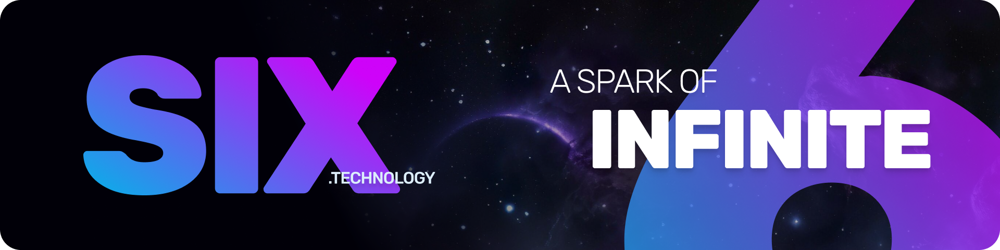

# Welcome to Six — thanks for stopping by! 👋

We build practical, modern developer tools and libraries to help teams ship reliable, maintainable software faster. 

On this GitHub org, you’ll find a mix of open-source projects, templates, integrations, and internal tooling focused on real-world productivity: primarily around .NET / ASP.NET Core, Avalonia, and similar.

<!--

**Here are some ideas to get you started:**

🙋‍♀️ A short introduction - what is your organization all about?
🌈 Contribution guidelines - how can the community get involved?
👩‍💻 Useful resources - where can the community find your docs? Is there anything else the community should know?
🍿 Fun facts - what does your team eat for breakfast?
🧙 Remember, you can do mighty things with the power of [Markdown](https://docs.github.com/github/writing-on-github/getting-started-with-writing-and-formatting-on-github/basic-writing-and-formatting-syntax)
-->
